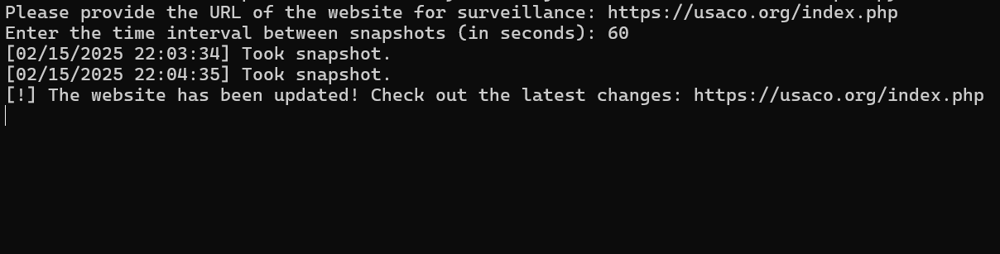

This console application captures snapshots of a user-inputted website at regular intervals; upon detecting any changes in the site's content, it notifies the user via an audio alert.

## How it works

The user inputs the website's URL and the time interval between snapshots. The program initiates periodic captures of the website's HTML content. When a change is detected, it alerts the user by playing the Windows exclamation sound at 3-second intervals until acknowledged. 

## Why is it useful

This application automates website monitoring, providing timely notifications for critical updates. Some of my key use cases include:  

1. **Tracking Programming Contest Pages**: Monitors official contest pages for updates such as rule changes, deadlines, or winner announcements

2. **Monitoring Olympiad Results**: Tracks official websites for the publication of Olympiad results

**Advantages**: Lightweight, easy to use, delivers instant alerts to eliminate manual checks and ensure users stay informed effortlessly.  
